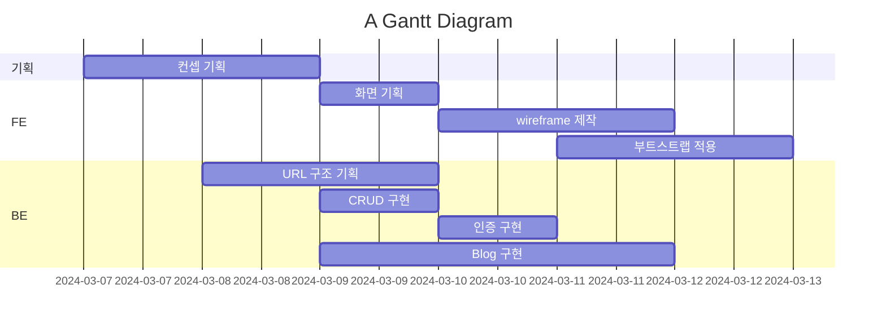
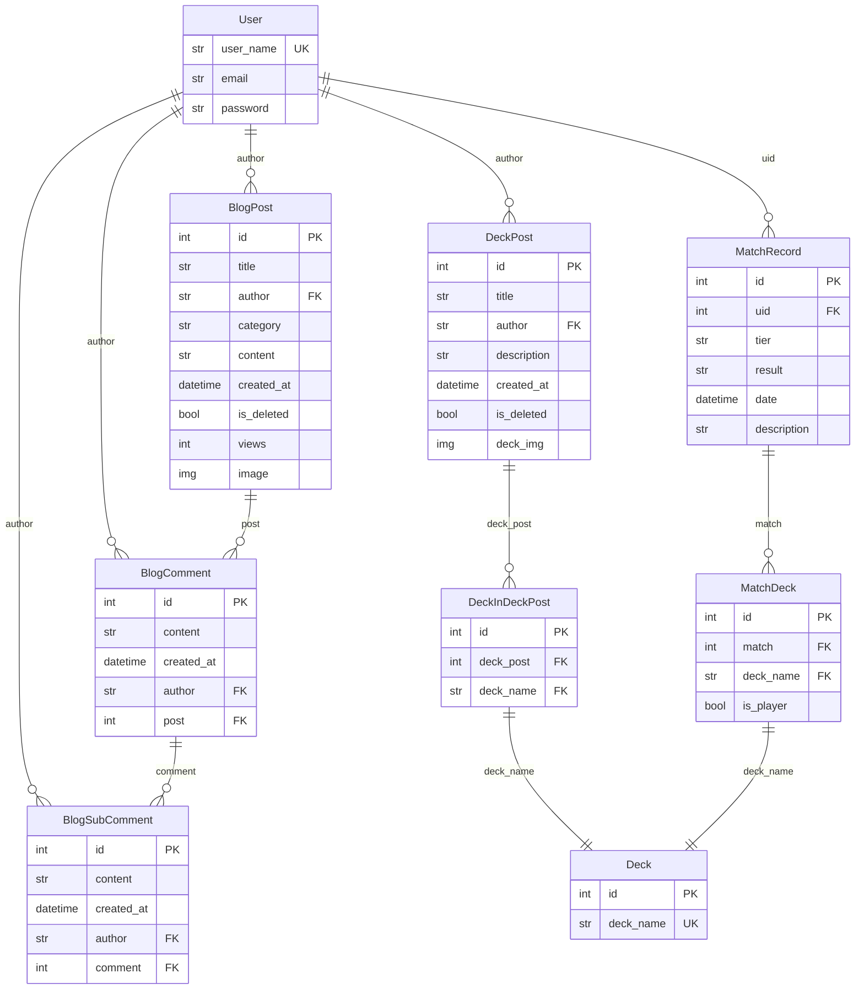

# YGO_Blog

---

## WBS

```mermaid
gantt
    title A Gantt Diagram
    dateFormat  YYYY-MM-DD
    section 기획
    컨셉 기획           :2024-03-07, 2d
    section FE
    화면 기획      :2024-03-9  , 1d
    wireframe 제작 : 2024-03-10, 2d
    부트스트랩 적용 : 2024-03-11, 2d
    section BE
    URL 구조 기획   : 2024-03-08, 2d
    CRUD 구현   : 2024-03-09, 1d
    인증 구현   : 2024-03-10, 1d
    Blog 구현   : 2024-03-09, 3d
```

## 설계

---

### URL 구조

```mermaid
graph TD;
    Home('') --> Admin("admin/")
    Home --> Main("Main")
    Home --> Blog("blog/")
    Home --> Decks("decks/")
    Main --> Register("register/")
    Main --> Login("login/")
    Main --> Logout("logout/")
    Main --> Account("account/&lt;int:pk&gt;/")
    Blog --> BlogList("''")
    Blog --> BlogDetail("&lt;int:pk&gt;/")
    Blog --> BlogWrite("write/")
    Blog --> BlogEdit("edit/&lt;int:pk&gt;/")
    Blog --> BlogDelete("delete/&lt;int:pk&gt;/")
    Blog --> BlogSearch("search/&lt;str:category&gt;")
    Blog --> BlogRestore("restore/&lt;int:pk&gt;/")
    Blog --> CommentWrite("comment/write/&lt;int:pk&gt;/")
    Blog --> CommentEdit("comment/edit/&lt;int:comment_pk&gt;/")
    Blog --> CommentDelete("comment/delete/&lt;int:comment_pk&gt;/")
    Blog --> SubCommentWrite("subcomment/write/&lt;int:comment_pk&gt;/")
    Blog --> SubCommentEdit("subcomment/edit/&lt;int:subcomment_pk&gt;/")
    Blog --> SubCommentDelete("subcomment/delete/&lt;int:subcomment_pk&gt;/")
    Decks --> DeckList("''")
    Decks --> DeckDetail("&lt;int:pk&gt;/")
    Decks --> DeckPostWrite("deck_post/write/")
    Decks --> MatchRecordList("match_record/")
    Decks --> MatchRecordDetail("match_record/&lt;int:pk&gt;/")
    Decks --> MatchRecordWrite("match_record/write/")


```

### ER Diagram

---

```mermaid
erDiagram
    User {
        str user_name UK
        str email
        str password
    }

    BlogPost {
        int id PK
        str title
        str author FK
        str category
        str content
        datetime created_at
        bool is_deleted
        int views
        img image
    }

    BlogComment {
        int id PK
        str content
        datetime created_at
        str author FK
        int post FK
    }

    BlogSubComment {
        int id PK
        str content
        datetime created_at
        str author FK
        int comment FK
    }

    DeckPost {
        int id PK
        str title
        str author FK
        str description
        datetime created_at
        bool is_deleted
        img deck_img
    }

    DeckInDeckPost {
        int id PK
        int deck_post FK
        str deck_name FK
    }

    Deck {
        int id PK
        str deck_name UK
    }

    MatchRecord {
        int id PK
        int uid FK
        str tier
        str result
        datetime date
        str description
    }

    MatchDeck {
        int id PK
        int match FK
        str deck_name FK
        bool is_player
    }

    User ||--o{ BlogPost : "author"
    User ||--o{ BlogComment : "author"
    User ||--o{ BlogSubComment : "author"
    User ||--o{ MatchRecord : "uid"
    User ||--o{ DeckPost : "author"
    BlogPost ||--o{ BlogComment : "post"
    BlogComment ||--o{ BlogSubComment : "comment"
    DeckPost ||--o{ DeckInDeckPost : "deck_post"
    DeckInDeckPost ||--|| Deck : "deck_name"
    MatchRecord ||--o{ MatchDeck : "match"
    MatchDeck ||--|| Deck : "deck_name"
```
