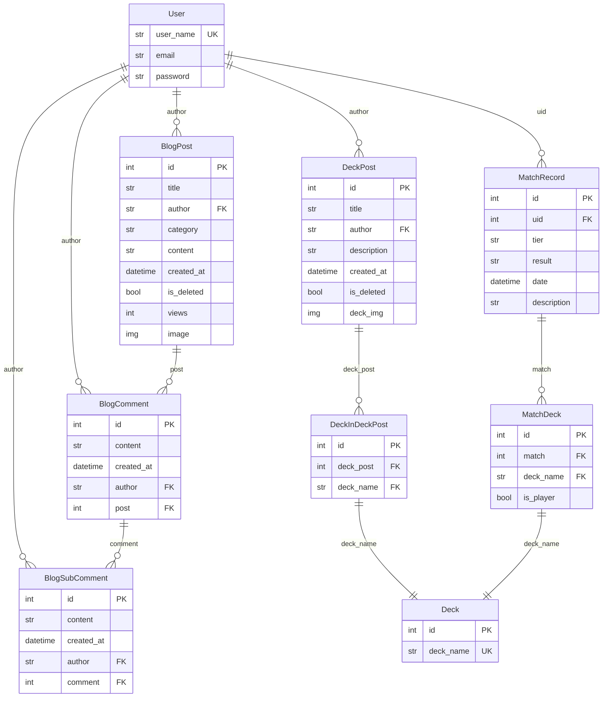

# YGO_Blog

---

## 설계

---

### ER Diagram

---

```mermaid
erDiagram
    User {
        str user_name UK
        str email
        str password
    }

    BlogPost {
        int id PK
        str title
        str author FK
        str category
        str content
        datetime created_at
        bool is_deleted
        int views
        img image
    }

    BlogComment {
        int id PK
        str content
        datetime created_at
        str author FK
        int post FK
    }

    BlogSubComment {
        int id PK
        str content
        datetime created_at
        str author FK
        int comment FK
    }

    DeckPost {
        int id PK
        str title
        str author FK
        str description
        datetime created_at
        bool is_deleted
        img deck_img
    }

    DeckInDeckPost {
        int id PK
        int deck_post FK
        str deck_name FK
    }

    Deck {
        int id PK
        str deck_name UK
    }

    MatchRecord {
        int id PK
        int uid FK
        str tier
        str result
        datetime date
        str description
    }

    MatchDeck {
        int id PK
        int match FK
        str deck_name FK
        bool is_player
    }

    User ||--o{ BlogPost : "author"
    User ||--o{ BlogComment : "author"
    User ||--o{ BlogSubComment : "author"
    User ||--o{ MatchRecord : "uid"
    User ||--o{ DeckPost : "author"
    BlogPost ||--o{ BlogComment : "post"
    BlogComment ||--o{ BlogSubComment : "comment"
    DeckPost ||--o{ DeckInDeckPost : "deck_post"
    DeckInDeckPost ||--|| Deck : "deck_name"
    MatchRecord ||--o{ MatchDeck : "match"
    MatchDeck ||--|| Deck : "deck_name"
```
