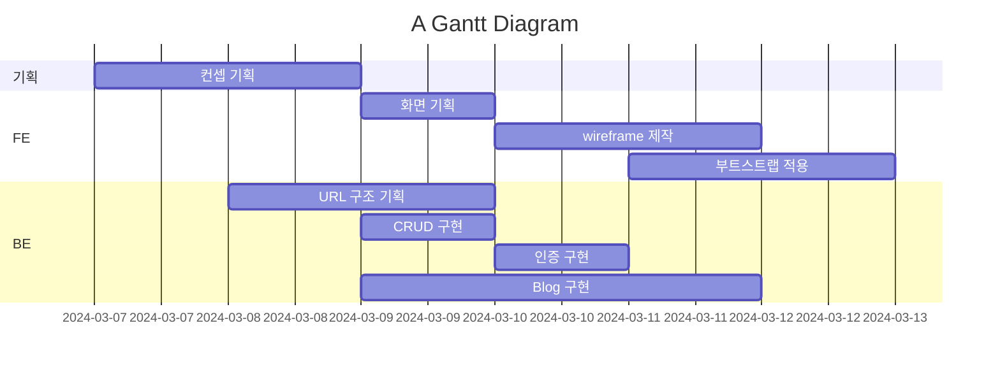
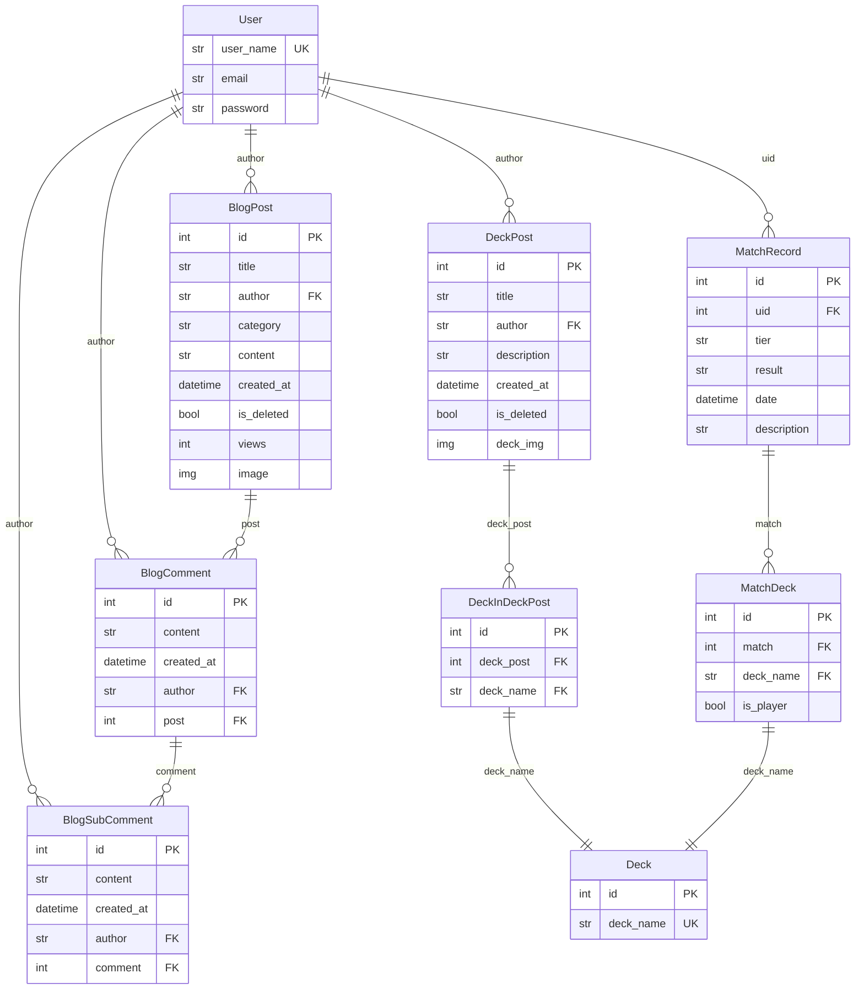

# YGO_Blog

---

## 개요

---

### 1.1 개요

---

YGO Blog는 제가 좋아하는 게임중 하나인 유희왕에 대해 정보 공유를 할 수 있게 만들어진 Blog입니다.

사용자들이 글을 올리는 게시판 형태의 Blog와,
게임 정보 목적으로 사용하는 Decks로 나뉘어져 있습니다.

### 1.2 기능

Main

- 메인
- 현재 계정정보 조회
- 회원가입
- 로그인
- 로그아웃

Blog

- 게시글 작성, 수정, 삭제
- 댓글, 대댓글 작성, 수정, 삭제
- 게시글 검색 by category

- 삭제된 게시글 복구

Decks

- 덱 포스트 작성, 수정, 삭제
- 매치 기록 작성, 수정, 삭제

### 1.3 개발환경

- vscode
- django framework
- python

- html, css, js
- bootstrap

- git, github

#### WBS

## 설계

---

### Wireframe

---

### 실제 화면

- 메인 페이지

- 덱 리스트

- 덱 상세

### URL 구조

---

| App    | URL                                       | Views                        | Html                      | Note                                   |
|--------|-------------------------------------------|------------------------------|---------------------------|----------------------------------------|
| Admin  | 'admin/'                                  | Django admin                 | Django admin templates    | Django 관리자 인터페이스                |
| Main   | ''                                        | MainView                     | index.html                | 메인 페이지                             |
|        | 'register/'                               | RegisterView                 | register.html             | 회원가입 페이지                         |
|        | 'login/'                                  | LoginView                    | login.html                | 로그인 페이지                           |
|        | 'logout/'                                 | LogoutView                   | redirect to main          | 로그아웃 액션, 메인으로 리다이렉트       |
|        | 'account/<int:pk>/'                       | AccountView                  | account.html              | 사용자 계정 상세 페이지                  |
| Blog   | 'blog/'                                   | BlogListView                 | blog_list.html            | 블로그 리스트 페이지                    |
|        | 'blog/<int:pk>/'                          | BlogDetailView               | blog_detail.html          | 블로그 상세 페이지                      |
|        | 'blog/write/'                             | PostCreateView               | blog_write.html           | 블로그 작성 페이지                      |
|        | 'blog/edit/<int:pk>/'                     | PostUpdateView               | blog_write.html           | 블로그 수정 페이지                      |
|        | 'blog/delete/<int:pk>/'                   | PostDeleteView               | redirect to blog list     | 블로그 삭제 액션, 리스트로 리다이렉트    |
|        | 'blog/search/<str:category>/'             | BlogSearchView               | blog_search_list.html     | 블로그 카테고리 검색 결과 페이지         |
|        | 'blog/restore/<int:pk>/'                  | PostRestoreView              | redirect to blog detail   | 삭제된 블로그 복구 액션                  |
|        | 'blog/comment/write/<int:pk>/'            | CreateCommentView            | redirect to blog detail   | 댓글 작성 액션                           |
|        | 'blog/comment/edit/<int:comment_pk>/'     | UpdateCommentView            | redirect to blog detail   | 댓글 수정 액션                           |
|        | 'blog/comment/delete/<int:comment_pk>/'   | DeleteCommentView            | redirect to blog detail   | 댓글 삭제 액션                           |
|        | 'blog/subcomment/write/<int:comment_pk>/' | CreateSubCommentView         | redirect to blog detail   | 대댓글 작성 액션                         |
|        | 'blog/subcomment/edit/<int:subcomment_pk>/' | UpdateSubCommentView       | redirect to blog detail   | 대댓글 수정 액션                         |
|        | 'blog/subcomment/delete/<int:subcomment_pk>/' | DeleteSubCommentView     | redirect to blog detail   | 대댓글 삭제 액션                         |
| Decks  | 'decks/'                                  | DeckListView                 | deck_list.html            | 덱 리스트 페이지                        |
|        | 'decks/<int:pk>/'                         | DeckDetailView               | deck_detail.html          | 덱 상세 페이지                          |
|        | 'decks/create/'                           | DeckPostCreateView           | deck_create.html          | 덱 포스트 작성 페이지                   |
|        | 'decks/match_records/'                    | MatchRecordListView          | match_record_list.html    | 매치 기록 리스트 페이지                 |
|        | 'decks/match_records/<int:pk>/'           | MatchRecordDetailView        | match_record_detail.html  | 매치 기록 상세 페이지                   |
|        | 'decks/match_records/create/'             | MatchRecordCreateView        | match_record_create.html  | 매치 기록 작성 페이지                   |

### ER Diagram

---

